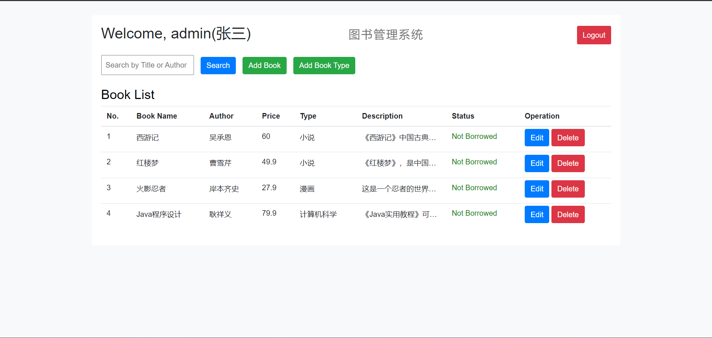
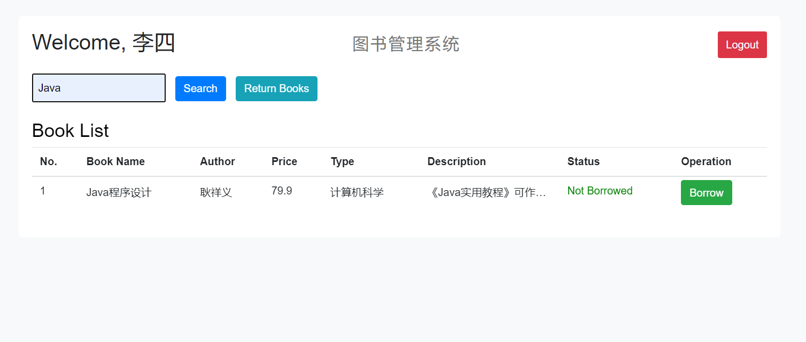

## 项目介绍

SpringBoot-JSP-MySQL的图书管理系统项目。

后端使用Java+SpringBoot+MyBatis+MySQL

前端使用JSP+Bootstrap

对应的后端文件夹如下：src/main/java

对应的前端文件夹如下：src/main/webapp

User功能：图书查询、图书借阅、图书归还、登录注册

Admin功能: 管理员登录、图书管理、图书类型管理

## 项目截图

## 演示地址

项目演示地址：http://localhost:8080

管理员账号`张三`，密码`123`

读者账号`李四`，密码`123`

## 搭建步骤

### 后端程序

1、新建数据库book_manage_db，运行`schema.sql`文件。

2、打开项目，打开`src/main/resources/application.yml`，修改数据库等配置文件。

3、运行项目
